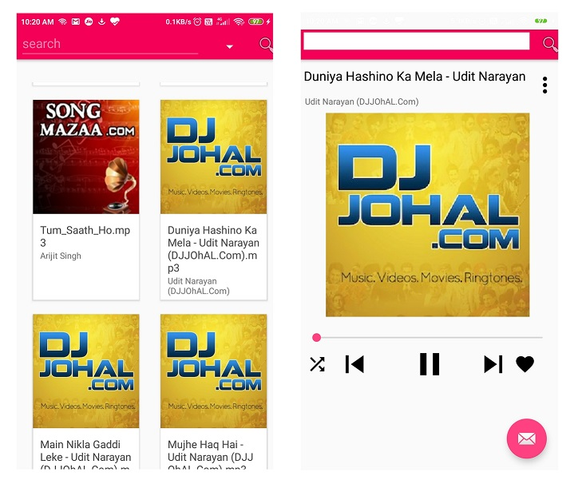

Music Player app developed for android using **kotlin** and **java**. It was academic project and was a first introductory project towards android development.

Key Features. 
1. Able to read all songs from SD card or internal storage of phone.
2. Able to play song in background
3. Able to like the favorited song.
4. Play in loop
5. Play with suffle. 
6. Seek at any position withing song.
7. Search song by name, artist, and other meta present in mp3 file

For this I used java MusicPlayer class. which did most of playing job. Threading concepts were used widely to load songs in search songs. For huge songs only top 10 will shown on screen more will load with scorll down.